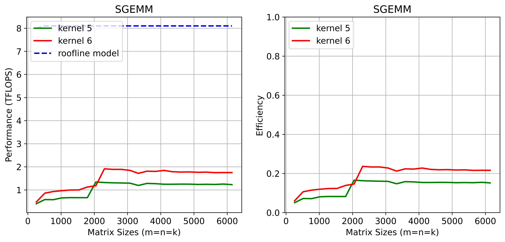
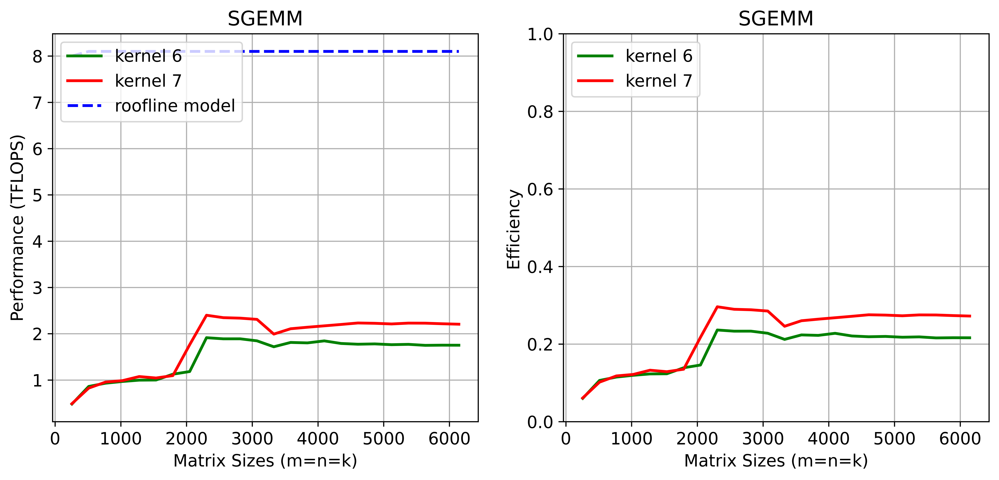
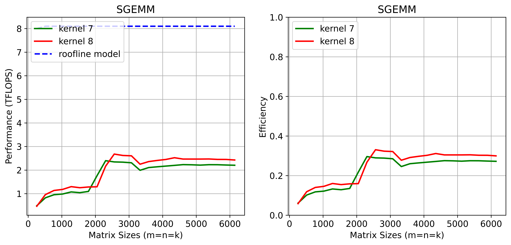
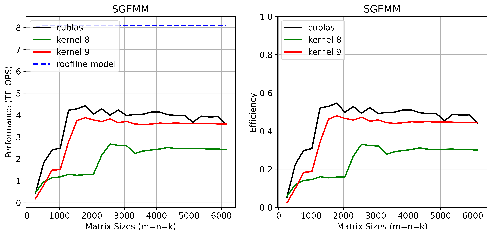
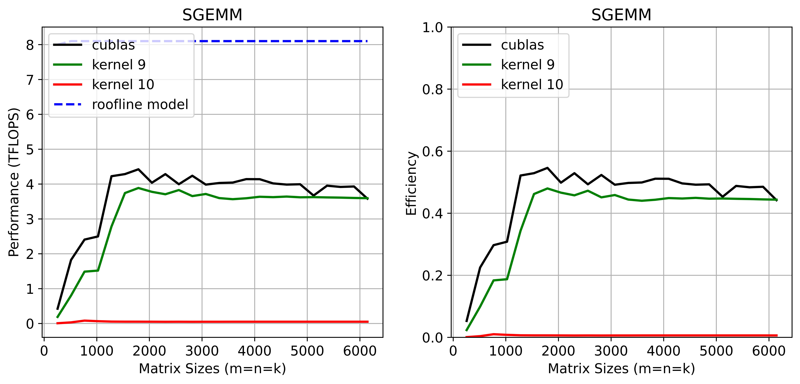
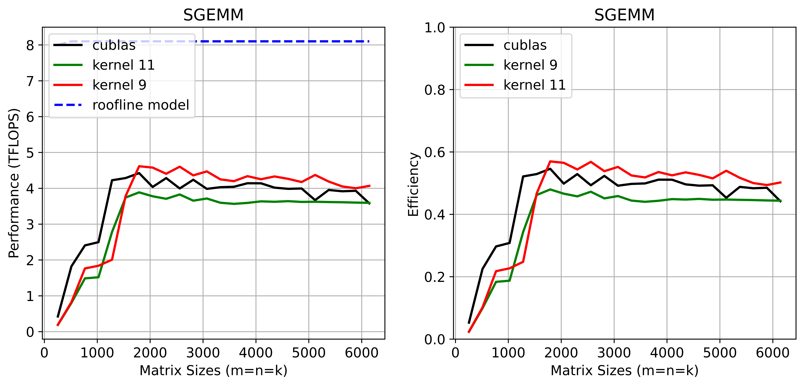
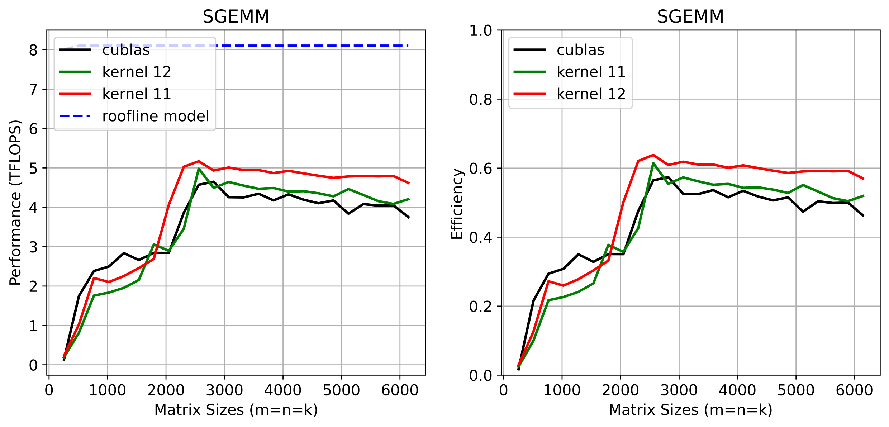
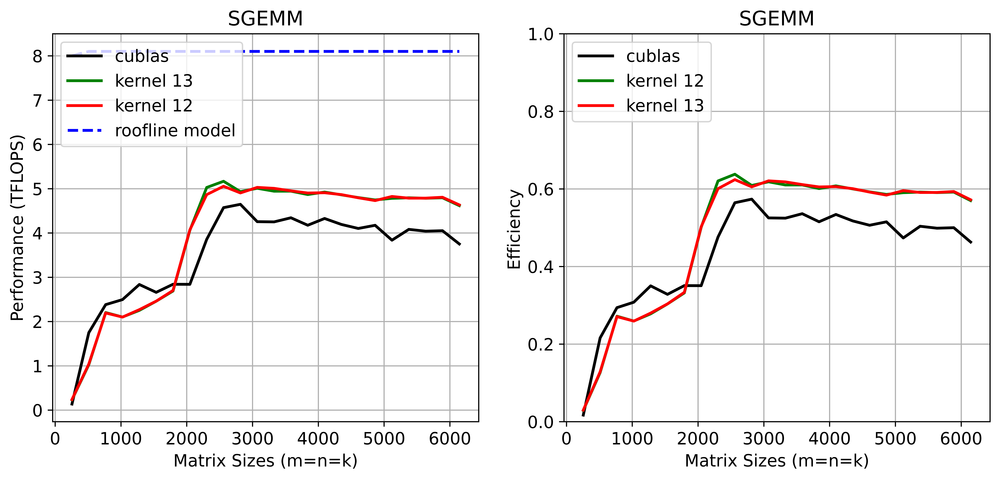

# HPCDeepNerualNetworks
Cuda implementation of SAXPY, SDOT and SGEMM.
## 1. SAXPY and SDOT
Custom kernels outperform cublasSaxpy and cublasSdot on Turing4.


## 2. SGEMM
- [x] Learn the definition of leading dimension, and tell the difference between row-major storage and column-major storage.
- [x] Theoretical peak perf of FP32 on Turing4: min(8100 GFLOPS, N * 31.25GFLOPS).
- [x] Row major GEMM on CPU
- [x] Call cublasSgemm under row major: AB=C -> B'A'=C'
- [x] Validation of CPU GEMM and cublasSgemm 
- [x] Implement GPU version SGEMM, validate the correctness, and benchmarking the performance for square matrices ranging 256 to 6144.
- [ ] Optimize the baseline GPU SGEMM

### 2.1 Kernel 1: basline GPU SGEMM
* Naive implmentation, each thread calculates a different index C<sub>ij</sub> for matrix C.

* How to transfer from column major to row major
```
B(col major) = B'(row major)
```

| Column Major  | Row Major |
| ----------- | ----------- |
|      AxB = C      |      B'xA'=C'       |
|   cublasSgemm(...A(col major), B(col major)...)  | cublasSgemm(...B(row major), A(row major)...)        |

### 2.2 Kernel 2: block matrix multiplication
* Each thread block calculates a different block C_block<sub>ij</sub> for matrix C.
* $Cblock_{ij} = \sum_{k} Ablock_{ik} * Bblock_{kj}$ 
* Load $Ablock_{ik}, Bblock_{kj}$ into shared memory to accelerate. 

#### 2.2 Kernel 2': Obey spatial locality within a warp (actually I am not sure about this) in kernel 1 and kernel 2: 
* Possible reasons: threads in same warp should load data from a same memory block to avoid serialization and satisfy **spatial locality**.

### 2.3 Kernel 3: Calculate 4 index $C_{ij}, C_{ij+1}, C_{ij+2},C_{ij+3}$ within a thread: 


### 2.4 Kernel 4: A modification of access order for kernel 3: 


### 2.5 Kernel 5: Vectorized load/store with float4 for kernel 4: 


### 2.6 Kernel 6: Each thread computes for 4x4 elements in C (4x1 in Kernel 5): 
* 8x8 threads in a threadblock.


### 2.7 Kernel 7: 8x8 threads/block -> 16x16 thread/block, using array size (64, 64) on shared memory: 
* 16x16 threads in a threadblock, each block holds two arrays with size 4096 on shared memory.


### 2.8 Kernel 8: keep shared memory array size 1024 by using array size (64, 16): 
* 16x16 threads in a threadblock, each block holds two arrays with size 64x16=1024 on shared memory.


### 2.9 Kernel 9: keep shared memory array size 1024 by using array size (128, 8): 
* 16x16 threads in a threadblock, each block holds two arrays with size 128x8=1024 on shared memory.
* Remarks: Consecutively read data from global memory matters!


### 2.10 Kernel 10: keep shared memory array size 1024 by using fragement size (256, 4): 
* This performance is bad!


### 2.11 Kernel 11: Warp level block: organize threads in the same warp (8 x 4, namely 8 x 2 float4 for subvectors in B fragment, and 4 x 2 float4 for subvectors in A fragment).
Outperform cuBLAS :)


### 2.12 Kernel 12: Prefetching
* 2 stage: 1) global memory -> shared memory; 2) shared memory -> register 


### 2.12 Kernel 12: Shared memory double cache to avoid a syncthreads
* Double the shared memory and alternating between the first part and second part.
