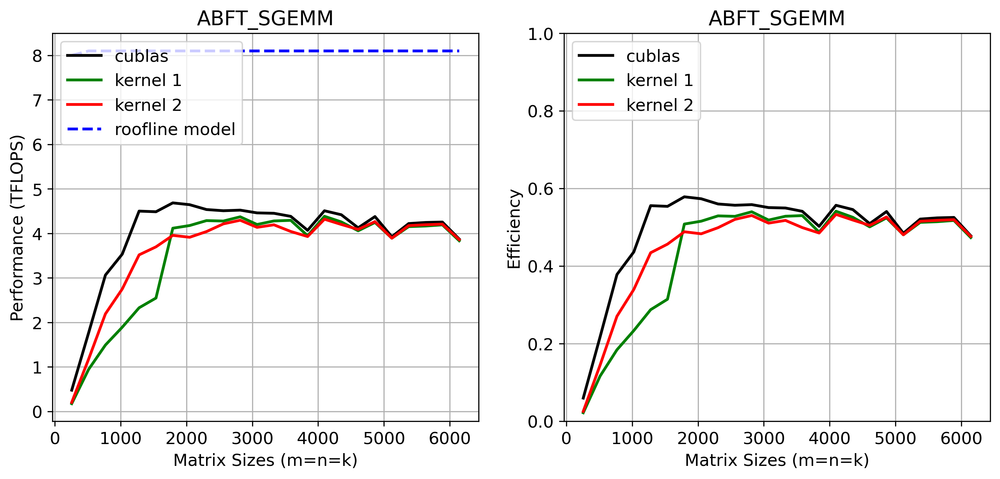

# HPCDeepNerualNetworks
Cuda implementation of ABFT_GEMM
## 1. ABFT GEMM
### 1.1 Kernel 1: One col sum for A, one row sum for B. $e^T$ = [1,1,...,1].
* $C$ = cublasSgemm( $A$, $B$ ).
* Calculate $e^TA$ and $Be$ : $r_1$ = cublasSgemv( $A^T$, $e$); $r_2$ = cublasSgemv( $B$, $e$).
* Calculate $e^TAB$ and $ABe$ : $r_1$ = cublasSgemv( $B^T$, $r_1$); $r_2$ = cublasSgemv( $A$, $r_2$).
* Calculate $e^TC$ and $Ce$ : $r_1'$ = cublasSgemv( $C^T$, $e$); $r_2'$ = cublasSgemv( $C$, $e$).
* Calculate the checksum difference $e^TAB - e^TC$ and $ABe-Ce$ : cublasSaxpy( $\alpha =-1$, $r_1$, $r_1'$), cublasSaxpy( $\alpha=-1$, $r_2$, $r_2'$).
* Compare the result with 0: cublasSdot( $r_1', e$), cublasSdot( $r_2', e$).
* 
$$\begin{bmatrix}A\\
e^TA\\ \end{bmatrix} \cdot \begin{bmatrix}B&Be\\ \end{bmatrix} = \begin{bmatrix}AB&ABe\\
e^TAB&e^TABe\\ \end{bmatrix}  \leftrightarrow \begin{bmatrix}C&Ce\\
e^TC&e^TCe\\ \end{bmatrix}$$
### 1.2 Kernel 2: Double row sums for B. $e^T_1$ = [1,1,...,1],  $e^T_2$ = [1,2,...,N].
* $C$ = cublasSgemm( $A,B$).
* Calculate $Be_1$ and $Be_2$ : $r_1$ = cublasSgemv( $B$, $e_1$); $r_2$ = cublasSgemv( $B$, $e_2$).
* Calculate $ABe_1$ and $ABe_2$ : $r_1$ = cublasSgemv( $A$, $r_1$); $r_2$ = cublasSgemv( $A$, $r_2$).
* Calculate $Ce_1$ and $Ce_2$ : $r_1'$ = cublasSgemv( $C$, $e_1$); $r_2'$ = cublasSgemv( $C$, $e_2$).
* Calculate the checksum difference $ABe_1 - Ce_1$ and $ABe_2-Ce_2$ : cublasSaxpy( $\alpha=-1$, $r_1$, $r_1'$), cublasSaxpy( $\alpha=-1$, $r_2$, $r_2'$).
* Compare the result with 0: cublasSdot( $r_1', e_1$), cublasSdot( $r_2', e_1$).

$$A \cdot \begin{bmatrix}B&Be_1&Be_2\\ \end{bmatrix} = \begin{bmatrix}AB&ABe_1&ABe_2\\
\end{bmatrix}  \leftrightarrow \begin{bmatrix}C&Ce_1&Ce_2\\
\end{bmatrix}$$

